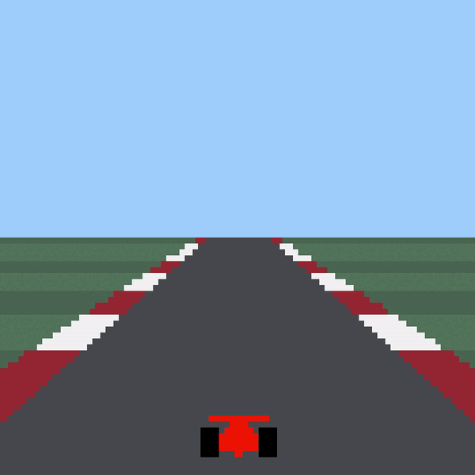
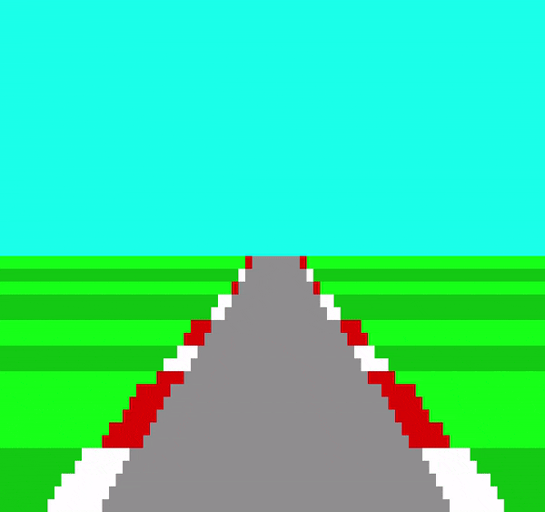

# LDTS_G0901 - Racing Game

Try to survive the longest on a fast paced circuit filled with dangerous obstacles.

This project was developed by André Barbosa (up202007398@edu.fe.up.pt), [Guilherme Almeida](https://github.com/theguilhermealmeida) (up202008866@edu.fe.up.pt) and [José Luís Rodrigues](https://github.com/jlcrodrigues) (up202008462@edu.fe.up.pt) for LDTS 2021/22.

## Implemented Features

### Car Movement
 - The user can use the keys to move the car left and right between the availabe lanes. This way, the position of the car is limited to 3 places only.

    

### Track Displaying 
 - The track is displayed simulating the progression of the car at a default speed.

    

## Planned Features

### Acceleration
- The track will move faster or slower according to users input.

### Obstacles
- There will be random obstacles updated on track while the car is moving.

## Design

#### GENERAL PATTERN ON THE PROGRAM

**Problem in Context**

We had to find a way of organising all the different classes on the program.

**The Pattern**

We have applied the **MVC** (Model-view-controller) pattern. This pattern allowed us to separate all classes in 3 different groups, one for each part of the project.

**Implementation**

We don't have UML representation yet.

**Consequences**

The use of the CMV Pattern in the current design allows the following benefits:

- Have a place of code containing only objects and informations about them(Model), that can be used for any other kind of program.
- Makes easier the Test Driven Development.

<!--#### KNOWN CODE SMELLS AND REFACTORING SUGGESTIONS-->

<!--### TESTING-->

### SELF-EVALUATION

- André Barbosa: 10%
- José Luís Rodrigues: 45%
- Guilherme Almeida: 45%
