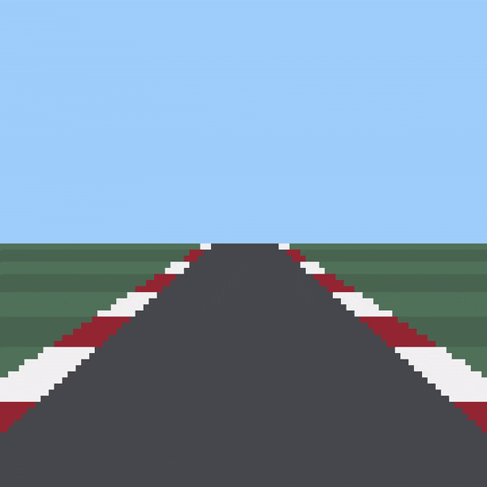
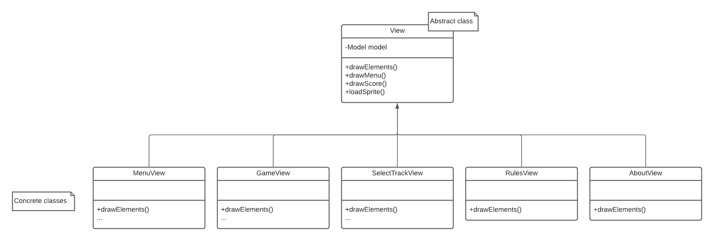
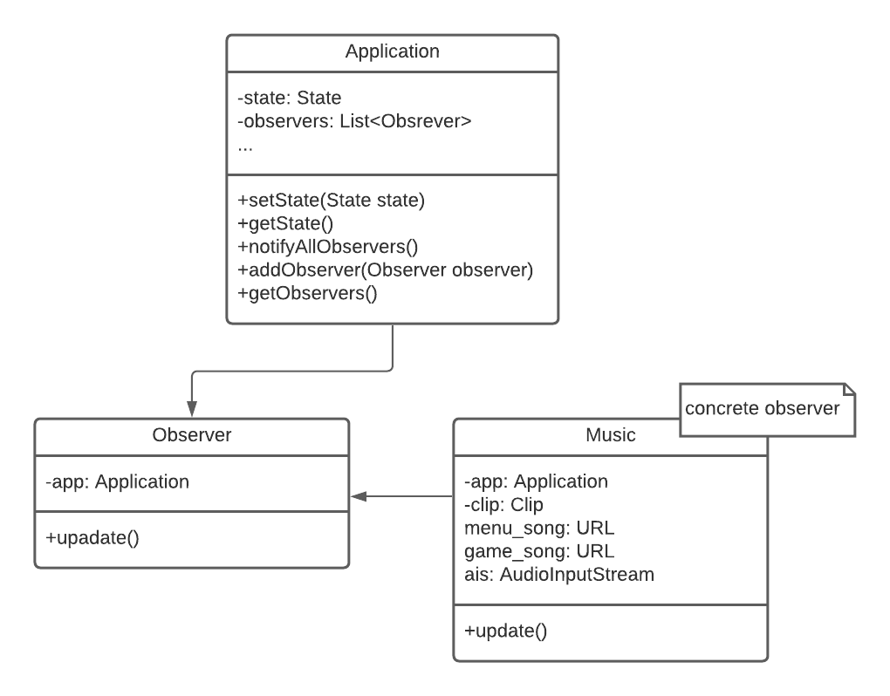
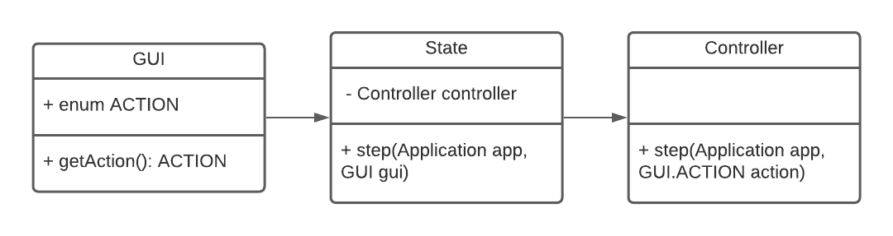

# LDTS_G0901 - Formula Zero

**Try to survive the longest on a fast paced circuit filled with dangerous obstacles.** 
The game has a series of tracks with increasing difficulty in which the player needs to avoid the coming cars to stay alive.

This project was developed in January 2022 by André Barbosa (up202007398@edu.fe.up.pt), [Guilherme Almeida](https://github.com/theguilhermealmeida) (up202008866@edu.fe.up.pt) and [José Luís Rodrigues](https://github.com/jlcrodrigues) (up202008462@edu.fe.up.pt) for LDTS 2021/22.

## Table of Contents
 * [Implemented Features](#implemented-features)
 * [Planned Features](#planned-features)
 * [Design](#design)
    * [Architecture](#architecture)
    * [State](#state)
    * [Template](#template)
    * [Music](#music)
    * [Actions](#actions)
 * [Code Smells and Refactors](#code-smells-and-refactors)
 * [Testing](#testing)
 * [Self Evaluation](#self-evaluation)

## Implemented Features

### Car Movement
 - The user can use the keys to move the car left and right between the availabe lanes. This way, the position of the car is limited to 3 places only.

    

### Track Displaying 
 - The track is rendered using pseudo 3d graphics. We also simulate it's movement so it appears the player is moving foward.

    

### Enemies generation
 - During gameplay, the user will approach different cars and needs to avoid them to stay alive. These enemies are randomly placed in the track.

    

### Score
 - The scoring system considers the number of enemies you avoid. For each avoided car you gain 10 points.

    

 
### Menu
 - When the application starts, a menu is prompted. This allows the user to navigate through different tabs.

    

### Track Selection
 - Tracks are stored in .txt files. This way, it's really easy to add new tracks, which allows a faster expansion of the game. To choose between the different tracks, a menu is displayed before the game starts.

    

## Planned Features

### High score
 - Store scores in files so they can be displayed in-game later in order to make the game more challenging.

### Turns
 - Tracks will have different turns so the game is more unpredictable. We can even simulate the curvature in real world tracks.

## Design

### Architecture

#### Problem in Context

To complete the game, we need to define it's data structures, display this data and be able to controll it according to user action.

#### The Pattern

To solve this problem, we separated the program into Model, View, and Controller, as the **MVC** pattern suggests. This allows us to separate each concern into its own class.

#### Implementation

 

    

#### Consequences

* Facilitates Test Driven Development.
* Accelerates the program development.
* Separate different parts of the code into different objects.

### State

#### Problem in Context

The games needs to iterate through the different menu tabs and the game itself. Before the game starts, the track selection is prompted and after the game is over it changes to a different Game Over tab.
This way, we need a way to manage which image is being displayed and how the game can behave accordingly.

    

#### The Pattern

The **State** pattern allows us to separate the state specific behaviour into different classes. This way, the main Application has a reference to the current state but doesn't have to worry about each state's implementation.

#### Implementation

    

#### Consequences

 * Easily add new states without changing the existing ones.
 * No need for flags or conditionals with numerous branches.
 * Allows a strict separations of specific code into different classes.

### Template

#### Problem in Context

The game has several states that need to be displayed to the user. The base code that's used to display them is the same, but each tab has its own characteristics. So we had to find a way to get rid of methods that did exactly the same thing, without jeopardizing the structure of the algorithm.

#### The Pattern

Using the **Template Method** we created an abstract class [View](../src/main/java/game/view/View.java) and several View subclasses for each of the states and objects. The abstract class contains the main methods that print all the different tabs, plus an abstract [method](../src/main/java/game/view/View.java#L29) that can be overridden by the subclasses.   Let's say we want display the GameOver tab. First we call the View class passing a game over model as a parameter. Then the [GameOverView](../src/main/java/game/view/menu/GameOverView.java) class overrides the drawElements() method and starts to call the right functions of the abstract class in the right order and with the right parameters.

#### Implementation

    

#### Consequences

* We can eliminate duplicated code.
* Very easy to add/remove new tabs.

### Music

#### Problem in context

To make the game more fun and interesting we wanted to add music. Our idea was to add a theme soundtrack in the Menu tab and a more fast paced music when racing. To accomplish this we had to think of a simple way to play the right music according to the state we're in.

#### The pattern

With the **Observer** pattern it's possible for the subject to notify all the observers whenever something important happens, in our case when the application's state changes. A subject can also 'cut relations' with a subject to stop receiving notifications at all, although we do not make use of this functionality.   
In practice: [setState(State state)](../src/main/java/game/Application.java#L57) is called -> changes states and calls [notifyObservers()](../src/main/java/game/Application.java#L72) -> it iterates through the observers list and calls the function [update()](../src/main/java/game/observer/Observer.java#L12) of each observer.  
We ended up making use of only the observer [Music](../src/main/java/game/observer/Music.java).

#### Implementation

    

#### Consequences

* Facilitates adding new musics to the other states.
* Makes sure that no other class has to deal with music related code.
* It's possible to add/remove observers if we need to.

### Actions

#### Problem in context

The user inputs are received by the View whose job is to pass these requests to the controller. It is important to make this connection so we can separate the game logic from the rendering code.  

#### The pattern

It could be argued that the **Command Pattern** would be a good solution for this problem. This pattern suggests the creation of a separate command class that contains all the information about the request. However, as we didn't need to reverse the operations and due to the simplicity of the requests we chose not to create this class. Instead we created an enum [ACTION](../src/main/java/game/gui/GUI.java#L24) that contains all the different actions that occur from user input.

#### Implementation

    

#### Consequences

* Allows the separation of the classes that receive input from the ones that interpret it.
* Keeps the codebase simple.
* It is not as easy to undo operations.

## Code Smells and Refactors

### Bloaters

#### Long Parameter List

Some methods in our code base have a long list of parameters. We can see this in [View.drawSprite()](../src/main/java/game/view/View.java) and [View.drawMenu()](../src/main/java/game/view/View.java). It happens here because of the different displaying options these methods are trying to provide.  
A way to solve this problem would be to replace some of these parameters with an object. For instance, creating a custom Sprite class would help mitigate the problem as the information used to draw a sprite could be grouped there. Another way to improve would be replacing some of the parameters with a method call. A case in point is the screen parameter that could be replaced by a call to the gui.

### Object-Orientation Abusers

#### Switch Statements

After the Controller receives an action from View it needs to decide what to do for all the different action types. This results in long switch statements in places like [MenuController.step()](../src/main/java/game/control/menu/MenuController.java) or [GUI.getAction()](../src/main/java/game/gui/GUI.java). This way, every time we add a condition all the switch statement code has to be modified.
Instead of a switch statement it would be possible to replace the actions enum with a class and the actions with subclasses. We could then move all action specific logic to the different subclasses thus replacing the control flow code with polymorphism. By doing this, it would be easier to add new actions and the code readability would improve.

### Dispensables

#### Speculative Generality

The [TrackModel](../src/main/java/game/model/game/TrackModel.java) class contains same setters ([setBackgroundColors()](../src/main/java/game/model/game/TrackModel.java#L84), [setTerrainColor()](../src/main/java/game/model/game/TrackModel.java#L88), [setKerbColor()](../src/main/java/game/model/game/TrackModel.java#L92), [setRoadColor](../src/main/java/game/model/game/TrackModel.java#L97)) that were created in case we needed to change the track colours. These methods can come in handy for future features, but they're never used in our code. We could use the refactoring method **Inline Method** to solve this problem. 

## Testing

### Coverage

    

   <a href="reports/coverage/index.html">Coverage Report</a>

### Mutation Testing

   

   <a href="reports/pitest/index.html">Pitest Mutation Report</a>

## Self Evaluation

- André Barbosa: 10%
- José Luís Rodrigues: 45%
- Guilherme Almeida: 45%
